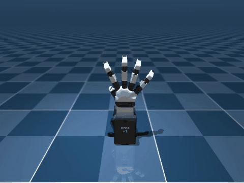
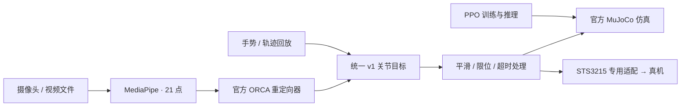

# ORCA Hand · 飞特 STS3215 版本

基于 **ORCA Hand v1 右手、17 个 STS3215 V12 舵机**的复现项目，包含硬件装配资料，以及真机控制、仿真学习和 RGB 视频遥操作软件。

**[英文会议 Slides（5 页）](docs/meeting.html)**：项目想法、实时遥操作、转笔任务与团队下一步。下载 HTML 后可离线播放内嵌视频；方向键翻页，`F` 全屏，`N` 显示英文讲稿。见 [演示说明](docs/software/meeting.md)。



**[打开 HTML 实验结果页](docs/results.html)**：视频演示、PPO 交互对比和逐关节轨迹。下载 HTML 后用浏览器打开即可，视频与数据均已内嵌，无需联网。

**[掌内转笔实验](docs/pen.html)**：新增有物体接触的 PPO 任务，对比不动手、随机动作和学习策略。目标为将笔转向 90° 并稳定保持，页面如实报告尚未完成的部分。

## 可以做什么

- **真机控制**：逐关节标定、平滑手势、逐指运动、状态记录和轨迹回放。
- **仿真训练**：官方 MuJoCo v1 模型上的 PPO 手势跟踪；附可直接加载的示例模型。
- **视频遥操作**：摄像头／视频文件 → MediaPipe 人手关键点 → 官方 ORCA 重定向器 → 仿真或真机。



## 当前验证状态

已在 **Apple Silicon Mac** 上跑通安装、仿真、训练、模型重载推理、视频重定向和轨迹回放。

- 三组 PPO 模型各评估 100 回合，成功率均为 **100%**；全回合平均关节误差 **1.45–1.83°**。
- 直接位置控制平均误差 **0.88°**；随机策略成功率 **14%**。PPO 示例用于学习完整训练流程。
- RGB 测试视频完成 170 帧处理，149 帧检测到右手，标定后输出 119 帧控制目标；包含丢手片段。
- 真人 Mac 摄像头录像完成 **40 秒 / 800 帧**离线仿真验证；主要手势阶段连续跟踪，丢手保持与恢复通过，拇指和捏合仍需改进。
- 网页实时跟随已跑通：摄像头骨架与仿真并排刷新，现场采样约 **19 FPS**；支持重新标定与关闭摄像头。
- **真机尚未验证**：本轮未连接舵机，需要对你的装配逐关节标定。
- Linux 已提供锁定依赖和 CI 工作流，尚未在实际 Linux 设备运行。

成功标准、测试素材范围和原始结果见 [验证报告](docs/software/validation.md)。

## 快速开始

需要 Python、[uv](https://docs.astral.sh/uv/getting-started/installation/) 和网络。首次下载包含官方模型网格，体积较大。

```bash
python3 scripts/bootstrap.py
uv sync --frozen --extra hardware --extra train --extra teleop
source .venv/bin/activate
orca-hand doctor
```

### 1. 看基础动作

```bash
orca-hand demo --headless --fast --video --output runs/first-demo
```

打开 `runs/first-demo/simulation.mp4`。交互窗口在 Mac 上使用：

```bash
.venv/bin/mjpython -m orca_feetech.cli demo --output runs/interactive
```

### 2. 运行附带的 PPO 模型

```bash
orca-hand infer --checkpoint artifacts/pretrained/gesture-v1/policy.zip \
  --video --output runs/first-inference
```

重新训练与评估：

```bash
orca-hand train --steps 120000 --num-envs 4 --output runs/my-policy
orca-hand evaluate --checkpoint runs/my-policy/policy.zip \
  --episodes 100 --output runs/my-evaluation
```

### 3. 用摄像头控制仿真手

浏览器中实时并排查看摄像头骨架与仿真手：

```bash
.venv/bin/python scripts/webcam_live.py
```

打开 `http://127.0.0.1:8767/`，点击“开始实时跟随”。张开右手，保持约 30 个有效帧完成尺度标定，然后缓慢做手势。页面可重新标定或停止摄像头。

也可以使用独立的仿真与视频窗口：

```bash
.venv/bin/mjpython -m orca_feetech.cli teleop \
  --source camera:0 --show-video --output runs/webcam
```

已有视频也可以直接运行：

```bash
orca-hand teleop --source /path/to/right-hand.mp4 \
  --headless --video --output runs/video-test
```

没有摄像头也可以运行 [可复现的视频测试](docs/software/teleop.md#不用摄像头的功能验证)。

## 操作与实现文档

- [环境安装与 Mac / Linux 运行](docs/software/setup.md)
- [真机接线、标定与控制](docs/software/hardware.md)
- [仿真任务、训练和推理](docs/software/learning.md)
- [掌内转笔任务与复现](docs/software/pen.md)
- [RGB 视频重定向](docs/software/teleop.md)
- [接口、坐标与软件架构](docs/software/architecture.md)
- [验证结果与演示](docs/software/validation.md)
- [官方仓库复用与版本记录](docs/software/upstream.md)

真机开始前先阅读标定文档。`configs/hardware.template.yaml` 的舵机编号是待核验候选值，尤其需要确认拇指两个根部关节。

## 致谢

这个项目中的很多材料、思路和复现路径都来自 B 站一位很棒的 UP 主：**MrHuangsLabDIY**。

我是通过看他的视频，一步一步完成这个项目的。在跟着视频复现的过程中，我也做了一些自己的尝试，遇到了一些问题，也踩了不少坑。后续我会把这些经验慢慢整理并分享到这个仓库里，方便其他想复现 ORCA Hand 的朋友少走一些弯路。

## 硬件资料

- `docs/`：中文教程初版和几个简单检查表。
- `hardware/物料清单.xlsx`：当前版本用到的主要物料。
- `hardware/3d_print/`：官方 3D 模型和适配飞特舵机的改版模型。
- `hardware/走线图片/`：当前整理出的走线参考图片。

硬件搭建从 [STS3215 复现教程](docs/orcahand_sts3215_tutorial.md) 开始，结合 `hardware/` 目录逐步装配。

软件优先复用 [ORCA 官方项目](https://github.com/orcahand)，STS 通信采用 [飞特 SDK](https://github.com/ftservo/FTServo_Python)。第三方来源与适配边界见 [复用说明](docs/software/upstream.md)。
