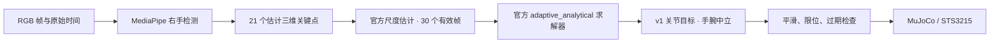

# RGB 视频 → ORCA 重定向

## 数据流



复用官方模型文件、关键点约定和重定向算法。项目增加同步的视频文件输入、源时间戳、镜像选择、掉帧处理、三维目标到硬件的标定转换。

v1 适配清除重复的指尖长度偏移，并用末节中点近似缺失的 DIP 关键点，详见 [版本适配说明](upstream.md#必要适配)。人体和机械手的自由度、比例不同，输出并非逐关节等角复制。已完成 40 秒真人摄像头录像的离线仿真验证；拇指方向与捏合仍有偏差，详见 [验证结果](validation.md#真人摄像头录像)。

## 摄像头

### 浏览器实时跟随

```bash
.venv/bin/python scripts/webcam_live.py
```

打开 `http://127.0.0.1:8767/`，点击“开始实时跟随”。左侧为实时摄像头骨架，右侧为同一帧对应的 ORCA v1 仿真。张开右手，保持约 2 秒完成 30 帧尺度标定，随后缓慢握拳、伸食指或捏合。

- 页面显示处理帧率、每帧处理耗时和画面年龄估算；需要时可重新标定。
- 相机线程只保留最新帧，推理和网页均不排队处理旧画面；超过 250 ms 的输入不会推进控制目标。
- 丢手时保持当前命令，重新检测到右手后恢复。手腕维持中立，继续使用已有速度与加速度限制。
- 点击停止或关闭页面会关闭摄像头；页面连接消失 45 秒后自动停止。此模式不保存视频。
- 镜像开关仅改变摄像头预览，不改变检测和重定向输入。

已在本机摄像头上观察到骨架与仿真实时联动。画面年龄从 Python 取得相机帧开始计时，网页加上请求往返与图片解码耗时作保守估计，不包含传感器曝光及屏幕扫描延迟；它也不等于手势动作到机械响应的完整延迟。

### 浏览器引导录制与验证

```bash
.venv/bin/python scripts/webcam_validation.py
```

打开终端显示的 `http://127.0.0.1:8766/`，启用 Mac 摄像头，准备好后点击“开始 40 秒验证”。页面依次提示张开右手、握拳、只伸食指、竖拇指、捏合、移出画面和重新张开。初始 8 秒用于保持张开与尺度标定。

摄像头由本机 Python 通过 macOS 原生接口读取，网页提供预览与操作指引。首次使用需在 Mac 摄像头权限提示中允许运行 Python 的应用。预览为镜像，保存的录像保留原始方向。

录制结束后自动关闭摄像头，运行视频检测与仿真，生成左右对照视频、逐阶段统计、指尖参考点距离和 HTML 报告。全部保存在 `runs/webcam-日期时间/`，不纳入 Git。该入口验证**真实摄像头录像的离线处理**；实时摄像头控制使用下方命令。

已有录像分析结果可直接重算诊断、刷新报告，无需再次录制：

```bash
.venv/bin/python scripts/review_webcam.py runs/webcam-日期时间
```

### 实时摄像头控制仿真

Mac 开交互仿真窗口：

```bash
.venv/bin/mjpython -m orca_feetech.cli teleop \
  --source camera:0 --show-video --output runs/webcam-session
```

展示右手，保持稳定约 30 个有效帧完成尺度估计，然后缓慢张开、弯指、捏合。按视频窗口的 `q` / Esc，或终端 Ctrl+C 退出。

`--confidence 0.7` 是默认检测、存在和跟踪阈值。帧内的 `handedness_score` 是左右手分类分数，不是每个三维点的测量精度。

## 视频文件

```bash
orca-hand teleop --source /path/to/right-hand.mp4 \
  --headless --video --output runs/video-session
```

文件按原始时间处理，重复／不可用的视频时间用帧率恢复。左右镜像会影响识别；仅当输入本身是镜像录像时使用 `--mirror-input`。默认不镜像。

输出包含：

- `rgb_overlay.mp4`：检测骨架和运行状态。
- `simulation.mp4`：使用 `--video` 时保存仿真。
- `landmarks.jsonl`：关键点、源时间戳和左右手分类分数。
- `trajectory.jsonl`、`tracking.png`：目标、实际下发量、反馈与输入有效状态。
- `vision_metrics.json`：有效帧数及本机处理耗时；此耗时不是相机曝光到舵机运动的完整延迟。

## 不用摄像头的功能验证

```bash
.venv/bin/python scripts/make_sample_video.py
orca-hand teleop --source local/fixtures/mediapipe_fixture.mp4 \
  --headless --video --output runs/fixture-check
```

素材来自 [Google MediaPipe 测试图片](https://github.com/google-ai-edge/mediapipe/blob/master/mediapipe/tasks/python/test/vision/hand_landmarker_test.py)，脚本检查 SHA-256，然后把三张静态图片与黑帧组成视频。它验证真实 RGB 检测、手势切换和丢手行为，不代表复杂背景下的实时跟随质量。

## 转到真机

先完成 [逐关节标定](hardware.md)，在仿真中验证同一录制轨迹，再按低速真机回放检查动作：

```bash
orca-hand replay runs/video-session/trajectory.jsonl --backend hardware \
  --config local/hand.yaml --output runs/hardware-replay
orca-hand teleop --source camera:0 --backend hardware \
  --config local/hand.yaml --show-video --output runs/hardware-teleop
```

真机后端在首个有效重定向结果产生后才初始化。失去有效输入时不会用旧关键点冒充新帧；250 ms 后停止推进目标，2 秒后独立卸力，恢复需重启。

单目三维关键点是估计值，遮挡、快速运动和手背朝向都会影响质量。首版只跟踪手指；手腕固定，不从缺少前臂参考的手部视频推断腕角。
