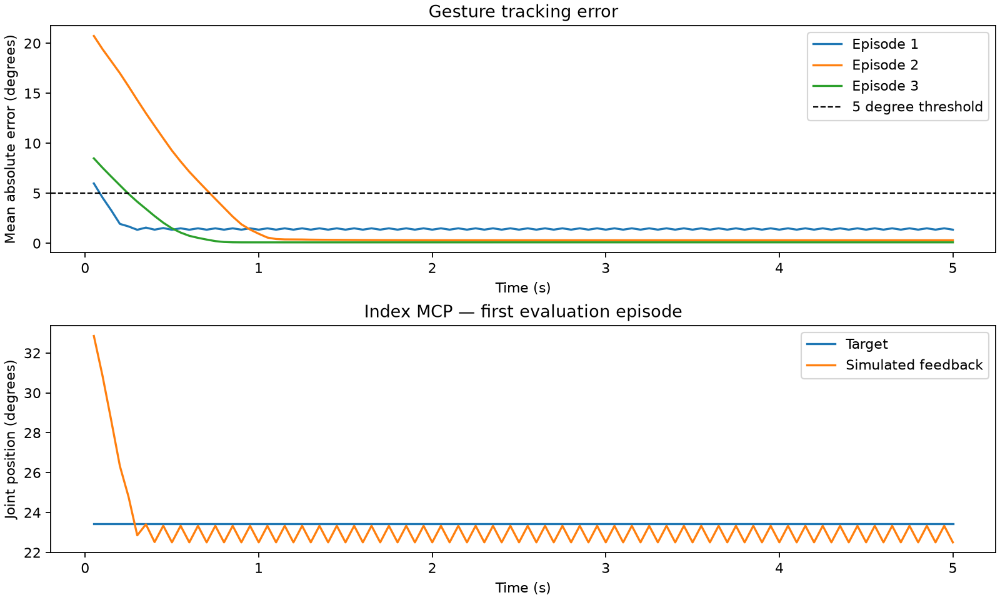

# 验证结果与演示

日期：2026-09-14。环境：Apple M4 Max、macOS 15.7.3、Python 3.11.1。原始摘要见 [summary.json](../../artifacts/validation/summary.json)。

[HTML 交互结果页](../results.html) 可离线查看演示视频、策略对比、训练奖励和逐关节轨迹；运行 `python3 scripts/build_results.py` 可从仓库中的数据快照重新生成。

## 已验证

本机自动化测试 **35 项通过**（2026-09-15 复核），Ruff 检查通过。测试摘要与运行范围记录在 `artifacts/validation/summary.json`。

- 固定提交的官方依赖安装，MuJoCo v1 加载、具名关节映射和离屏渲染。
- URDF/MJCF 的 18 个共同节点，在基础手势和随机姿态下位置／旋转一致。
- 重定向指尖与 URDF 指尖一致；虚拟 DIP 不与 PIP 重合；RGB 指向手势正确区分食指伸直与中指弯曲。
- 五次多项式轨迹、速度限制、超时输入拒绝、录制和回放。
- STS SDK 七字节位置报文、正反向标定换算、缺失标定拒绝、异常反馈与看门狗卸力。
- PPO 训练、checkpoint 重载、独立评估，以及 RGB 检测 → 官方求解器 → 仿真控制。

测试不会连接实际串口。硬件异常使用注入的假总线验证；RGB 测试使用真实 MediaPipe 检测与官方优化器。

## PPO：三个训练种子

训练种子 0、1、2，各执行 120,832 个仿真控制步。每组独立评估 100 回合，测试种子均为 20000–20099；随机初始姿态、离散手势和未固定的插值目标共用同一分布。

- Seed 0：成功率 **100%**；全回合平均误差 **1.83°**，终帧平均误差 **1.11°**。
- Seed 1：成功率 **100%**；全回合平均误差 **1.63°**，终帧平均误差 **0.91°**。
- Seed 2：成功率 **100%**；全回合平均误差 **1.45°**，终帧平均误差 **0.74°**。
- 直接位置控制：成功率 **100%**；全回合平均误差 **0.88°**。
- 随机策略：成功率 **14%**；全回合平均误差 **12.64°**。

成功指一个 5 秒回合内，16 个手指关节平均绝对误差 ≤5°，连续保持 0.5 秒。它不代表每个关节始终 ≤5°，也不代表接触任务或真实手的误差。



Seed 0 额外在连续插值目标上评估 100 回合：平均误差 **2.77°**。这支持简单的连续目标跟踪；更复杂动作仍需另设任务验证。

## RGB 功能链路

素材为 Google MediaPipe 的三张测试图片组成的视频，中间加入黑帧。共 170 个控制采样帧，149 帧检测到右手；前 30 个有效帧用于尺度估计，之后生成 119 帧控制目标。

已检查指向手势中的食指／中指区别。拇指方向、握拳幅度仍有可见偏差；素材没有真人三维关节真值，因此不报告重定向精度或真人任务成功率。

检测、重定向、仿真与记录的本机处理耗时：中位数约 **43.4 ms**，P95 约 **60.2 ms**。该测量包含本机处理与绘制，不包含真实摄像头曝光及舵机运动延迟。丢手片段保持上一控制目标。

## 真人摄像头录像

Mac 原生摄像头完成 **40 秒、640×480、20 Hz** 引导录制：800 帧均来自不同的相机帧。录制后离线运行 MediaPipe → 官方 ORCA 求解器 → MuJoCo，并逐段检查真人／仿真对照视频。

- 共处理 **800 帧**，682 帧检测到右手；30 帧尺度标定后生成 **652 帧**控制目标。首次检测在 3.55 秒，首次输出目标在 5.05 秒。
- 8–32 秒主要手势阶段 **480/480 帧**连续检测与输出目标。总体检测帧比例包含开始等待和主动移出画面，不作为姿态准确率。
- 张开、握拳和只伸食指有明确的仿真响应。握拳／食指阶段最后 2 秒，16 个手指关节的目标与仿真反馈平均绝对误差分别为 **6.28° / 5.13°**，仍有跟踪偏差。
- 实际丢手发生在 **34.60–36.90 秒**，47 帧命令保持不变，**36.95 秒恢复**。该时段按数据确定，与录制提示的切换时间不同。
- 捏合阶段最后 2 秒，拇指与食指参考点间距中位数：目标 **11.9 mm**，仿真反馈 **12.1 mm**；关节跟踪误差 **0.84°**。由此推断，应重点检查单目姿态估计与重定向目标。参考点距离来自官方 URDF 正向运动学，不等于碰撞表面的接触间隙。
- 本机离线处理耗时：P50 **36.6 ms**，P95 **43.5 ms**。尚未测量实时摄像头到运动的完整延迟，也没有真人三维姿态真值。

本次对照视频、JSON 和 HTML 保存在本机 `runs/webcam-20260914-210341/`。运行中的报告地址为 `http://127.0.0.1:8766/report.html`。仓库仅记录汇总指标，真人视频保留在忽略目录中。

服务停止后可重新打开报告，支持视频时间跳转：

```bash
.venv/bin/python scripts/webcam_validation.py --serve-existing \
  --output runs/webcam-20260914-210341 --port 8766
```

## 网页实时跟随

使用 `scripts/webcam_live.py`，已在 Mac 原生摄像头上观察到真人骨架与官方 ORCA v1 仿真实时联动。相机只保留最新帧，网页的两张图来自同一次推理与仿真更新。

连续约 12 秒、每 0.2 秒读取一次状态，共 60 次采样，均处于有效跟踪状态，控制命令随手势变化。观测到的处理帧率范围 **19.1–19.6 FPS**；采样结束时最近 100 帧的处理耗时 P50 **44.0 ms**、P95 **53.3 ms**。页面另显示画面年龄估算，不能当作传感器到屏幕或机械响应的完整延迟。

本次实时采样未包含丢手时段；上述丢手保持与恢复的实测结果来自 40 秒录像。相关控制与视觉回归测试 **13 项通过**，Ruff 通过。启动和操作方式见 [浏览器实时跟随](teleop.md#浏览器实时跟随)。

## 演示文件

- [掌内转笔 HTML：物体任务、视频与独立评估](../pen.html)，PPO 约 60 万步后成功 1/32、掉落 6/32，仍为实验策略。
- [基础手势 MP4](../assets/software/gesture-demo.mp4)
- [PPO 独立推理 MP4](../assets/software/ppo-inference.mp4)
- [RGB 与仿真对照 MP4（测试图片序列）](../assets/software/teleop-fixture.mp4)
- [基础控制目标／反馈曲线](../assets/software/control-tracking.png)
- [训练评估奖励曲线](../assets/software/training.png)

附带模型位于 [artifacts/pretrained/gesture-v1](../../artifacts/pretrained/gesture-v1)，对应 Seed 0；按 README 中的命令即可加载。

## 尚需现场验证

**实体手**：目前没有舵机串口连接。需要完成 17 路映射、实测标定、单指与整手动作、视频低速回放、实时跟随和卸力测试。位置反馈是估计关节角，真实腱绳误差尚未测量。

**实时摄像头跟随质量**：已在 Mac 摄像头上跑通网页内的实时骨架与仿真联动，现场观察约 19 FPS。多角度、快速运动和复杂遮挡尚需系统评估，拇指与捏合映射仍需改进。

**Linux / NVIDIA**：2026-09-15 的 [Ubuntu 22.04 CPU CI](https://github.com/George121380/ORCA_Hand_Feetech_Version/actions/runs/35053184668) 已通过首次安装、Ruff、30 项测试（2 项跳过）、mock 控制、2,048 步 PPO 训练和模型重载推理。该工作流安装 hardware/train extras，跳过未安装视觉依赖的测试，不包含摄像头、离屏视频渲染或实体舵机验证。NVIDIA GPU 尚未验证，首版无需 GPU。

复现本机检查：

```bash
.venv/bin/pytest -q
.venv/bin/ruff check src scripts tests
.venv/bin/python scripts/benchmark.py
```
